# Use Azure Functions to process a CSV File and import data into Azure SQL

> NOTE: this tutorial is currently under development. This note will be removed when it is final. This lab may be moved to a separate repository at some point.

## Introduction

Extract, Transform, and Load (ETL) is a common business function that is often necessary for integration between different systems. Traditional approaches often involve setting up dedicated FTP servers then deploying scheduled jobs to parse files and translate them for business use. Serverless architecture makes the job easier because a trigger can fire when the file is uploaded. Azure Functions is small pieces of code that focus on a specific problem and are ideal for tackling tasks like ETL.

This tutorial demonstrates how to take a legacy process and migrate it to run 100% in the cloud using the Azure SQL Database-as-a-Service offering combined with Azure Functions. You start with a local development environment, build and test the process end-to-end, then create the cloud-based assets and deploy to Azure.

## Background

The following concepts are covered in this lab. Click on the following links to learn more about each functional area that is covered in the lab exercises.

* [Azure for .NET Developers](https://jlik.me/cab)
* [Azure Functions](https://jlik.me/cac)
* [Azure SQL](https://jlik.me/cad)
* [Azure Storage](https://jlik.me/cae)
* [Azure Blob Storage](https://jlik.me/caf)
* [Entity Framework](https://jlik.me/cah)

## Exercises

1. [Create an Azure Functions project](#exercise1)
2. [Test the project locally](#exercise2)
3. [Create the SQL database](#exercise3)
4. [Add and test the code to update the database](#exercise4)
5. [Create an Azure SQL Database](#exercise5)
6. [Migrate the database](#exercise6)
7. [Deploy the project to Azure](#exercise7)
8. [Test uploads](#exercise8)

<a name="exercise1"></a>

## 1. Create an Azure Functions project

This exercise introduces you to Azure Functions along with the ability to emulate storage and debug functions locally. The Azure Functions host makes it possible to run a full version of the functions host on your development machine.

### Prerequisites

* [Visual Studio 2017 15.5](https://jlik.me/b93) or later
* The Azure Development workload
* Azure Functions and Web Jobs Tools (15 or later) (*Should be installed automatically with the Azure Development workload*)

### Steps

1. Open Visual Studio 2017.
2. Select `File` then `New Project` and choose the `Azure Functions` template. Enter `FileProcessor` for the `Name`. Click `OK`.

    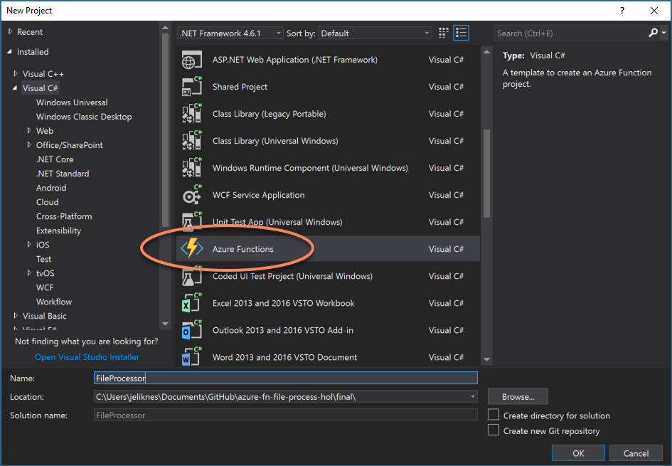
3. In the Azure Functions dialog, choose the `Azure Functions v1 (.NET Framework)` host and select the `Empty` project template. Make sure that `Storage Emulator` is selected for the `Storage Account`. (This automatically sets up connection strings for storage emulation.) Click `OK` and wait for the project to create.

    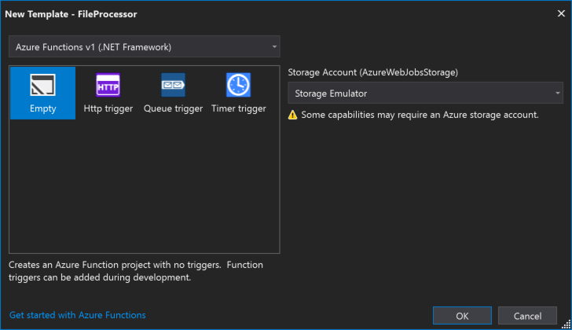
4. Right-click on the project name in the Solution Explorer and choose `Add` then `New Item...` 

    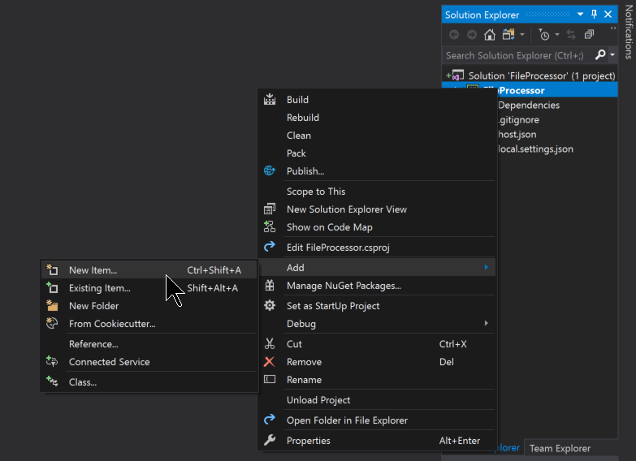
5. Select `Azure Function` for the item and give it the name `FileProcessFn.cs` and click `Add`.

    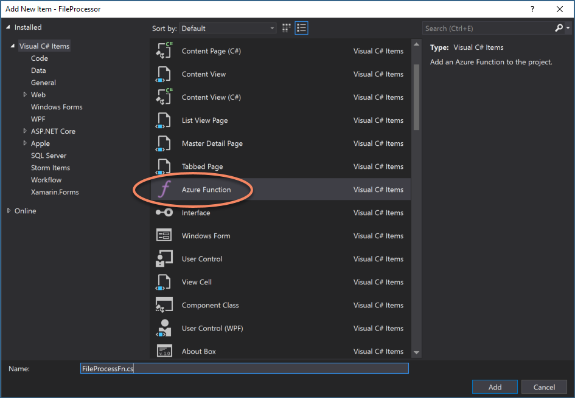
6. In the next dialog, choose the `Blob trigger` template. You can leave `Connection` blank or populate it with `AzureWebJobsStorage`. Type `import` for the `Path`.

    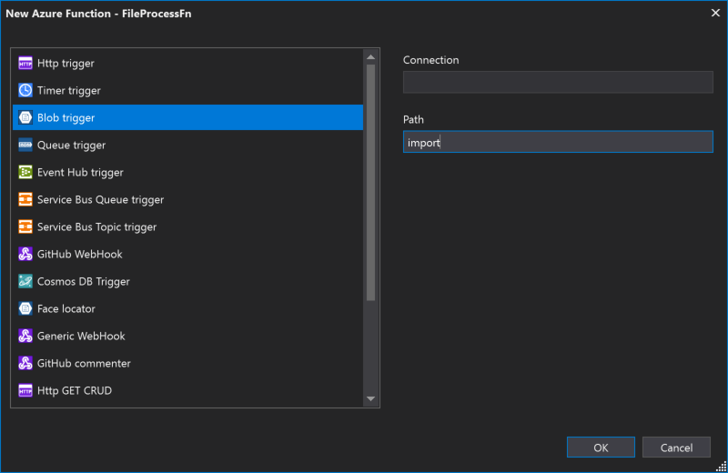
7. After the class is created, ensure it looks like this (if you did not fill out the `Connection` in the previous step, you can add it here):

    ```csharp
    namespace FileProcessor
    {
        public static class FileProcessFn
        {
            [FunctionName("FileProcessFn")]
            public static void Run([BlobTrigger("import/{name}", Connection = "AzureWebJobsStorage")]Stream myBlob, string name, TraceWriter log)
            {
                log.Info($"C# Blob trigger function Processed blob\n Name:{name} \n Size: {myBlob.Length} Bytes");
            }
        }
    }
    ```
8. In the Solution Explorer, open `local.settings.json`. It should have development storage set, like this:

    ```JavaScript
    {
        "IsEncrypted": false,
        "Values": {
            "AzureWebJobsStorage": "UseDevelopmentStorage=true",
            "AzureWebJobsDashboard": "UseDevelopmentStorage=true"
        }
    }
    ```

Learn more about [Azure Blob Storage Triggers](https://jlik.me/cag).

Now you've successfully created a function. The next exercise will walk through how to test it on your local machine.

<a name="exercise2"></a>

## 2. Test the project locally

### Prerequisites

* [Azure Storage Emulator](https://jlik.me/b94)
* [Azure Storage Explorer](https://jlik.me/b95)

### Steps

1. Launch the Storage Emulator by following the directions [here](https://jlik.me/b96).
2. Open Storage Explorer and navigate to `Blob Containers` in developer storage.

    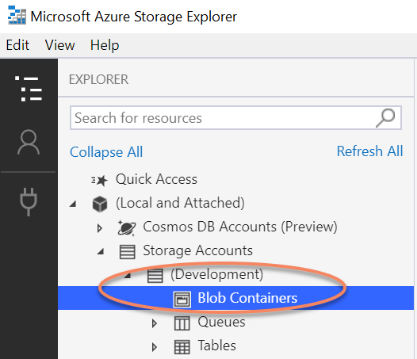
3. Right-click on `Blob Containers` and choose `Create Blob Container`. This opens a node that you can type the name for the container: `import`. Hit `ENTER` and the container details load.

    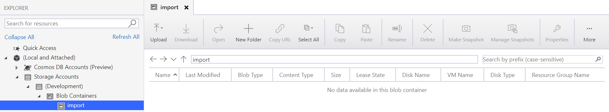
4. In Visual Studio, click the debug button or press `F5` to start debugging.

    
5. Wait for the functions host to start running. The console eventually shows the text `Debugger listening on [::]:5858` (your port may be different.)
6. In the Storage Explorer window for the `import` container, click the `Upload` button and choose the `Upload folder...` option.

    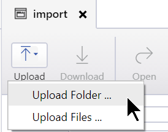
7. In the Upload Folder dialog, select the `data` folder that is provided with this tutorial. Make sure `Blob type` is set to `Block blob` and `Upload to folder (optional)` is empty. Click `Upload`.

    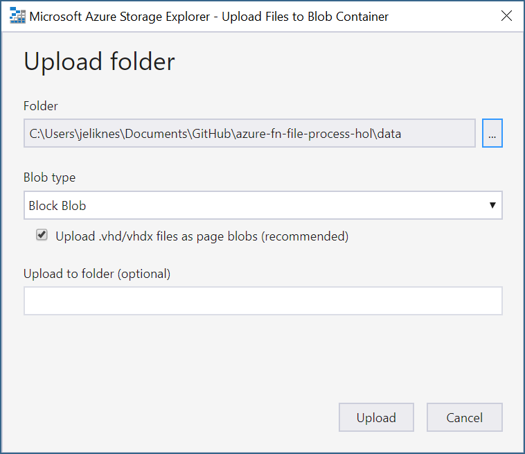
8. Confirm the files in the folder were processed by checking the logs in the function host console window.

    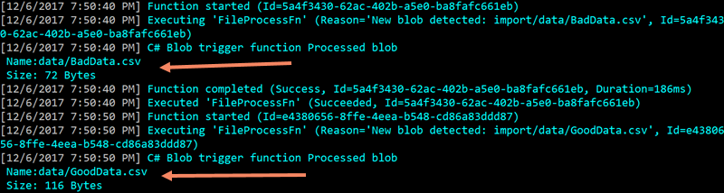
9. Stop the debugging session
10. Delete the `data` folder and files from the storage emulator.

The Azure Function is ready. In the next exercise, you will create a database and table to process the files into.

<a name="exercise3"></a>

## 3. Create the SQL Database

This exercise walks through creating the local SQL database for testing.

### Prerequisites

* [SQL Server Express](https://jlik.me/b97) (the full SQL Server version is fine too)
* [SQL Server Management Studio](https://jlik.me/b98) (SSMS)

### Steps 

1. Open SQL Server Management Studio and connect to your local server instance.
2. Right-click on the `Databases` node and choose `New Database...`

    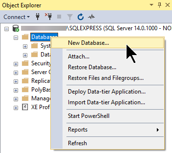
3. For the `Database name` type `todo`. Adjust any other settings you desire and click `OK`.

    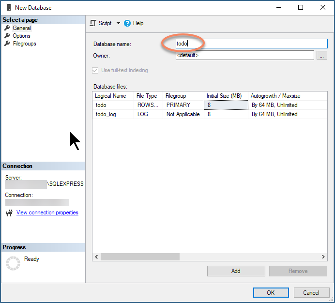
4. Right-click on the `todo` database and choose `New Query`. In the window that opens, type the following commands:

    ```SQL
    CREATE TABLE TodoItems (Id Int Identity, Task NVarChar(max), IsComplete Bit);
    INSERT TodoItems(Task, IsComplete) VALUES ('Insert first record', 1);
    SELECT * FROM TodoItems;
    ```
6. Click `Execute`.
7. Confirm that a single result is returned with "Insert first record" as the task.

The database is now ready. The next exercise will walk you through enhancing your function to parse the file and insert records into the database.

<a name="exercise4"></a>

## 4. Add and test the code to update the database

The local database is ready to test. In this exercise, you use Entity Framework to insert the records you parse from the uploaded files into the SQL database.

### Steps

1. Add the connection string for SQL Server to `local.json.settings`. It should look like this (example assumes SQL Express):

    ```JavaScript
    {
      "IsEncrypted": false,
      "Values": {
        "AzureWebJobsStorage": "UseDevelopmentStorage=true",
        "AzureWebJobsDashboard": "UseDevelopmentStorage=true"
      },
      "ConnectionStrings": {
        "TodoContext": "Server=localhost\\SQLEXPRESS;Database=todo;Trusted_Connection=True;"
      }
    }
    ```
2. In Visual Studio, add a class file named `TodoItem.cs` and populate it:

    ```CSharp
    namespace FileProcessor
    {
        public class TodoItem
        {
            public long Id { get; set; }
            public string Task { get; set; }
            public bool IsComplete { get; set; }
        }
    }
    ```
3. Open the `Package Manager Console` (under `Tools`) and type:
    
    `Install-Package EntityFramework`
4. Add another class file named `TodoContext.cs` then include the following code to define the database connections. The connection string name is passed to the base class in the constructor:

    ```CSharp
    using System.Data.Entity;
    
    namespace FileProcessor
    {
        public class TodoContext : DbContext
        {
            public TodoContext() : base("TodoContext")
            {
            }
    
            public DbSet<TodoItem> TodoItems { get; set; }
    
        }
    }
    ```
5. Open `FileProcessFn.cs` and change the `Run` method to be asynchronous by replacing `void` with `async Task`. Be sure to add `using System.Threading.Tasks` to the top of the file.
6. After the `log.Info` statement, add the structure for reading lines from the stream:

    ```CSharp
    if (myBlob.Length > 0)
    {
        using (var reader = new StreamReader(myBlob))
        {
            var lineNumber = 1;
            var line = await reader.ReadLineAsync();
            while (line != null)
            {
                await ProcessLine(name, line, lineNumber, log);
                line = await reader.ReadLineAsync();
                lineNumber++;
            }
        }
    }
    ```
7. Implement the `ProcessLine` method:

    ```CSharp
    private static async Task ProcessLine(string name, string line, int lineNumber, TraceWriter log)
    {
        if (string.IsNullOrWhiteSpace(line))
        {
            log.Warning($"{name}: {lineNumber} is empty.");
            return;
        }

        var parts = line.Split(',');
        if (parts.Length != 2)
        {
            log.Error($"{name}: {lineNumber} invalid data: {line}.");
            return;
        }

        var item = new TodoItem { Task = parts[0] };
        if ((int.TryParse(parts[1], out int complete) == false) || complete < 0 || complete > 1)
        {
            log.Error($"{name}: {lineNumber} bad complete flag: {parts[1]}.");
        }
        item.IsComplete = complete == 1;
    }
    ```
8. After setting the `IsComplete` flag, add the logic to check for duplicates and insert the record if it is unique:

    ```CSharp
    using (var context = new TodoContext())
    {
        if (context.TodoItems.Any(todo => todo.Task == item.Task))
        {
            log.Error($"{name}: {lineNumber} duplicate task: \"{item.Task}\".");
            return;
        }
        context.TodoItems.Add(item);
        await context.SaveChangesAsync();
        log.Info($"{name}: {lineNumber} inserted task: \"{item.Task}\" with id: {item.Id}.");
    }
    ```
9. Press `F5` to debug. In Azure Storage Explorer, upload `GoodData.csv` to the `import` container. You should see several success messages the functions console.

    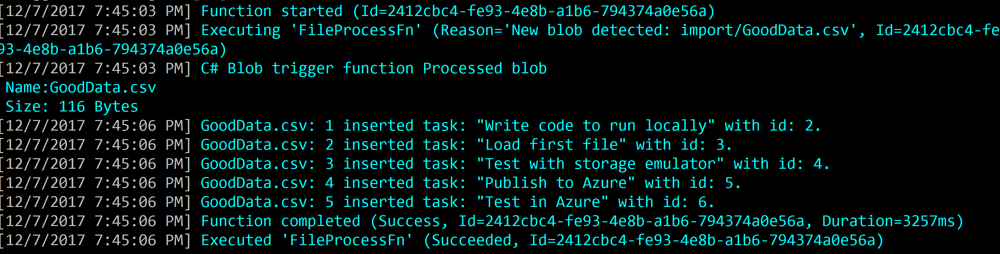
10. Upload `BadData.csv` and verify only a few records are processed and errors are printed.
11. Open SQL Server Management Studio and run the query:

    ```SQL
    SELECT * FROM TodoItems
    ```
12. Verify you receive results similar to this:

    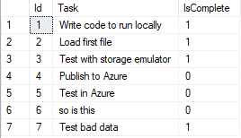
13. Delete the imported tasks by executing this SQL statement:

    ```SQL
    DELETE FROM TodoItems WHERE Id > 1
    ``` 

Now the project is successfully running locally. The next few exercises demonstrate how to move the process to Azure.

<a name="exercise5"></a>

## 5. Create the Azure SQL Database

Next, you create an Azure SQL database in the cloud. This exercise uses the [Azure portal](https://jlik.me/b7b).

### Prerequisites

* [Azure Subscription](https://jlik.me/b99)

### Steps

1. Choose `Create a resource` and search for or select `SQL Database`.

    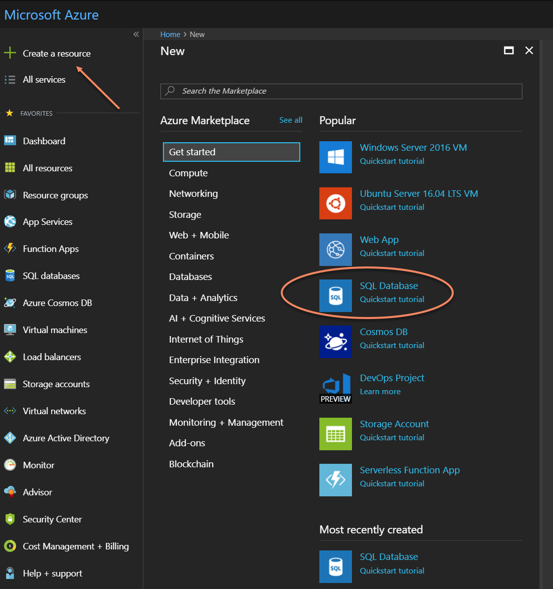
1. Enter a unique `Database name`.
2. Choose your `Azure subscription`.
3. Select the `Create new` option for `Resource group` and enter `my-todo-hol`.
4. Keep the default `Blank database` for `Select source`.
5. Click `Configure required settings` for `Server`.
6. Select `Create new server`.
7. Enter a unique `Server name`.
8. Provide a login and password. ***Note:** be sure to save your credentials!*
9. Pick your preferred `Location`.
10. Click the `Select` button.

    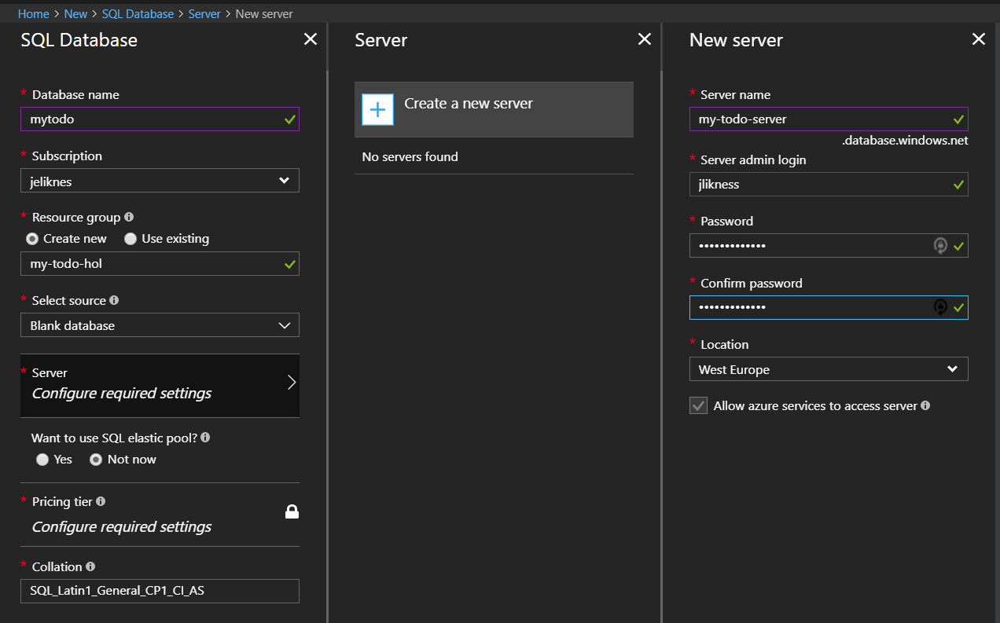
11. Click `Pricing tier`.
22. Slide the `DTU` bar to the lowest level for this lab.

    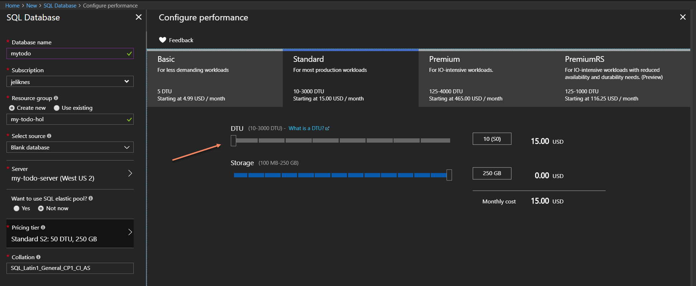
13. Tap `Apply`.
14. Check `Pin to dashboard`.
15. Click `Create`.
16. Once the database is created, navigate to the `Overview` for your database and select `Set server firewall.`

    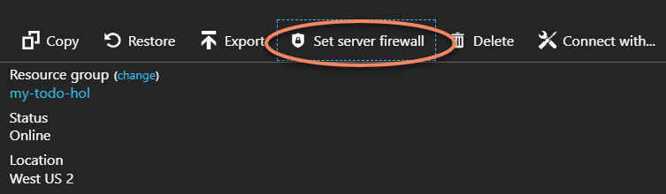
17. Click `Add client IP` to add your IP address, then click `Save`. Test that you can access the database by connecting from SQL Server Management Studio.

    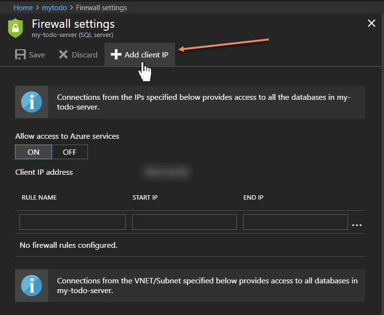

Wait for the deployment to complete (you will receive an alert) and then continue to the next exercise.

<a name="exercise6"></a>

## 6. Migrate the database

You can follow the steps in [Exercise 3 (Create the SQL Database)](#exercise3) to create and populate the Azure SQL tables, or you can migrate from your local SQL instance. If you choose to create the table yourself, you may [skip this exercise](#exercise7).

### Prerequisites

* [Microsoft Data Migration Assistant](https://jlik.me/caa)

### Steps

1. Open the Microsoft Data Migration Assistant
2. Click the plus sign to start a new project, check `Migration`, give the project a name and make sure the `Source server type` is `SQL Server` and the `Target server type` is `Azure SQL` with a `Migration scope` of `Schema and data`. Click `Create`.

    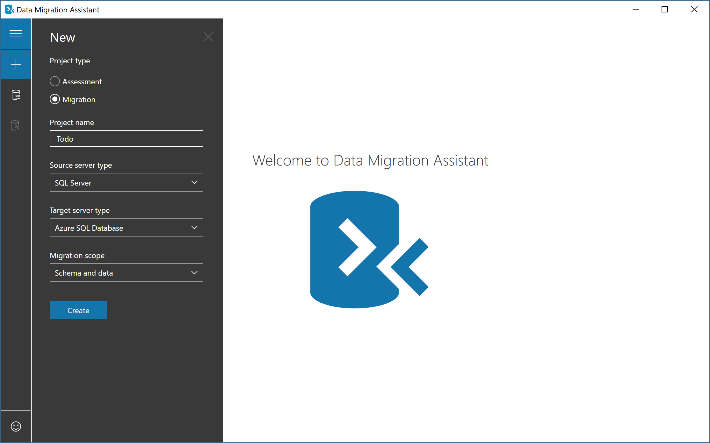
3. Fill out the credentials for the source server, click `Connect`, then select the database you created in [Exercise 3](#exercise3). Click `Next`.

    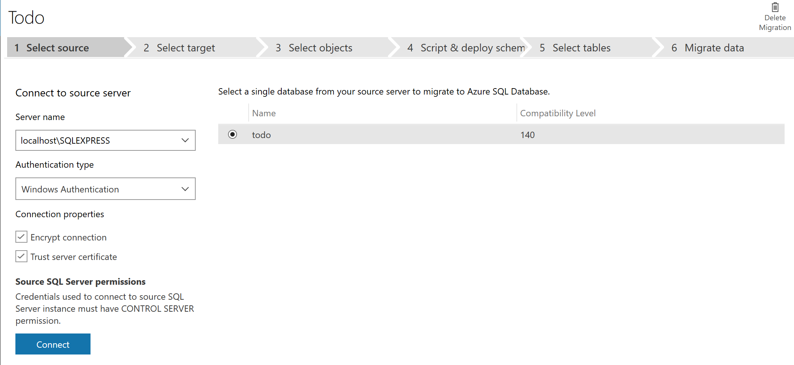
4. Fill out the credentials for the target server (Azure SQL) and click `Connect` then select the database you created in [Exercise 5](#exercise5). Click `Next`.

    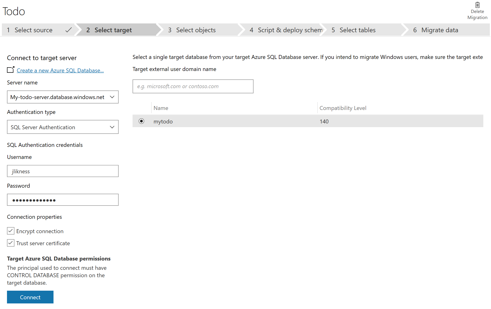
5. In the next dialog, make sure only `dbo.TodoItems` under `Tables` is checked and click `Generate SQL script`.
6. The next dialog will show you SQL script to create the table. Click `Deploy schema` to deploy the table to Azure SQL.
7. Verify the deployment was successful, then click `Migrate data`.
8. Click `Start data migration`.
9. Verify the migration was successful. You can test the migration by browsing the data in SQL Server Management Studio.

    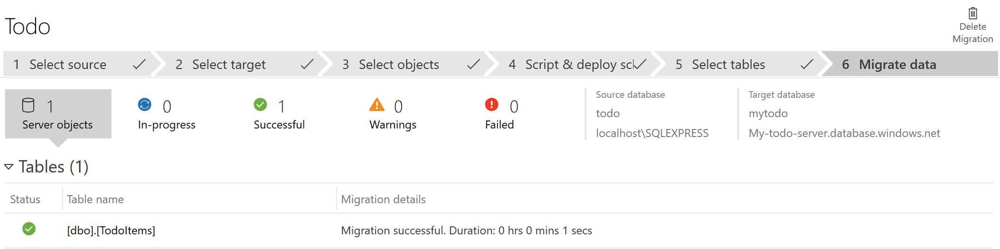

Now that the Azure SQL database is ready, you deploy the function to Azure.

<a name="exercise7"></a>

## 7. Deploy the project to Azure

In this exercise, you use the built-in Visual Studio tools to create a function app and app service plan and deploy your function to the cloud.

1. Inside Visual Studio, from the Solution Explorer right-click on the project name and choose `Publish...`.

    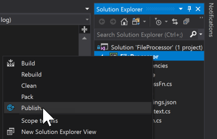
2. Choose `Azure Function App`, check `Create New`, and click `Publish`.

    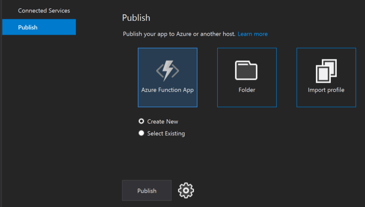
3. Give the app a unique name, choose your `Subscription`, and select the same `Resource Group` that you used for the [Azure SQL Server](#exercise5). For `App Service Plan` click `New...`.

    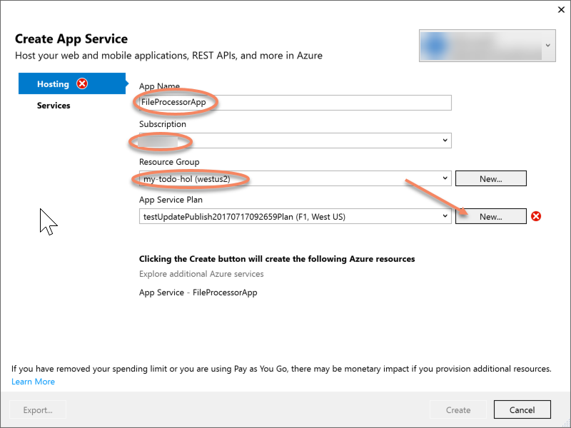
4. Give the plan a unique name, choose the `Location`, and pick `Consumption` for the `Size`. Click `OK`.

    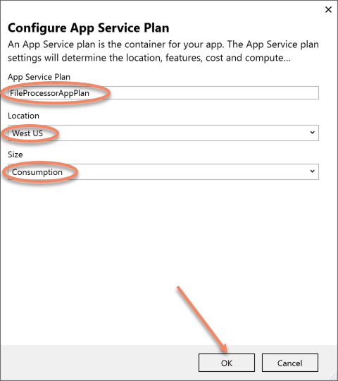
5. Back in the `Create App Service` dialog, click `Create`.

     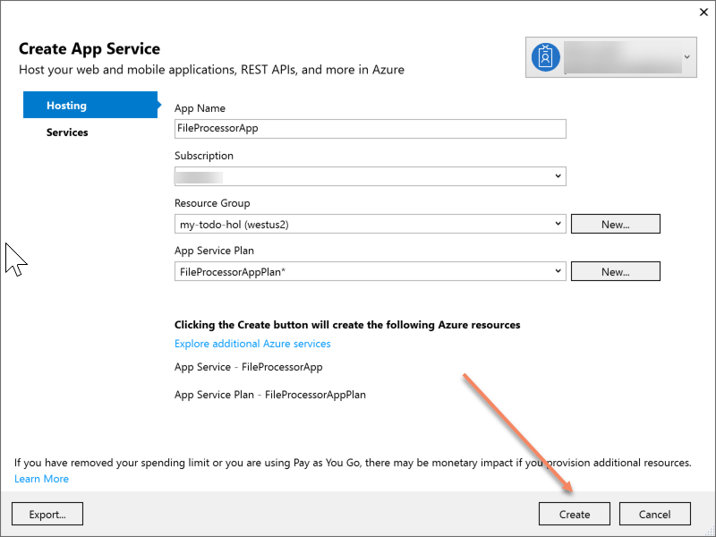
6. The publish shows build output and eventually the text `Publish completed.` when it's done.
7. Open your Azure SQL Database in the Azure portal and navigate to `Connection Strings`. Copy the connection string for `ADO.NET`.

    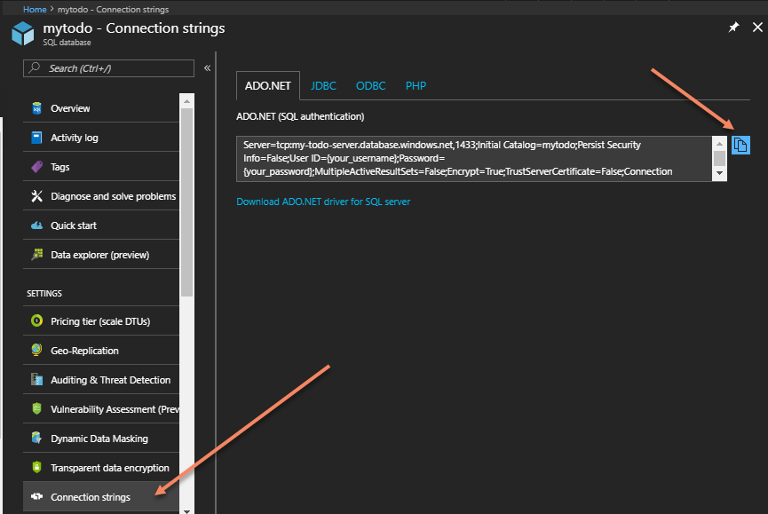
8. Navigate to the function app in the portal. Click `Application settings.`

    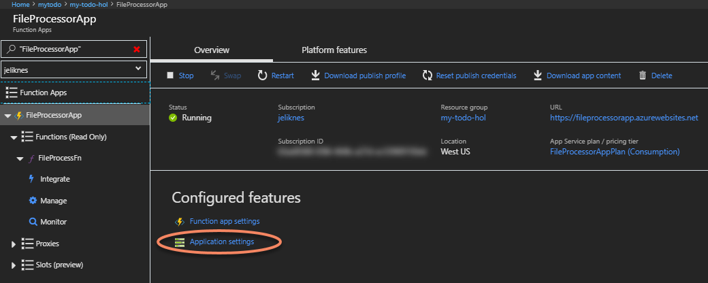
9. Scroll to the `Connection strings` section. Click `+ Add new connection string`. Type `TodoContext` for the name, paste the value from step 7 (be sure to update `{your_username}` and `{your_password}` to the correct values), and set the type to `SQLAzure`.

    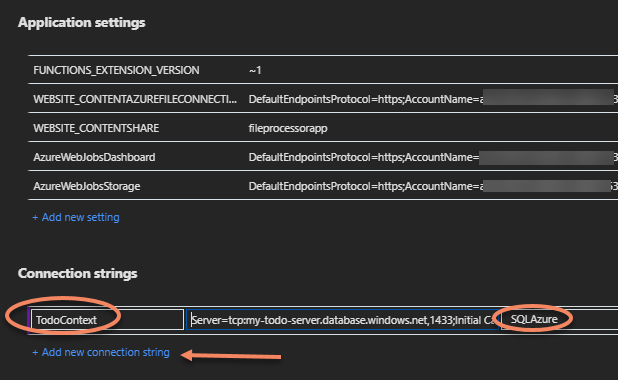
10. Above the `Connection strings` section is `Application settings`. Note the `AccountName` from the `AzureWebJobsStorage` entry to get the storage account name.
11. Scroll to the top and click `Save`.

Everything has been deployed and configured in Azure. In the next step, you will create the `import` container and upload files to test the cloud implementation.

<a name="exercise8"></a>

## 8. Test uploads

Now the function app is deployed and configured. This last exercise helps you create a blog container, upload the file, and test the processing trigger.

1. Navigate to the storage account from step 10. It should be the only storage account in your resource group. Click on `Blobs`.

    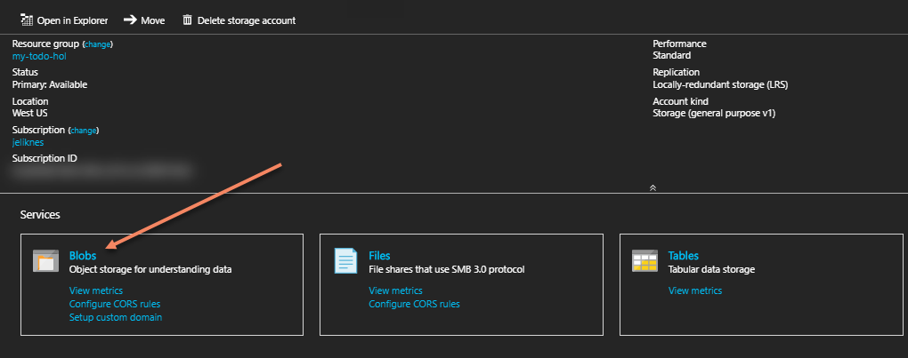
2. From the Blob service page, click `+ Container` to add a new container.

    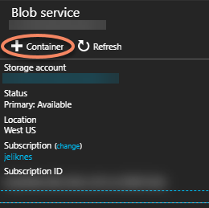
3. Type `import` for the name, leave `Public access level` at `Private (no anonymous access)` and click `OK`.

    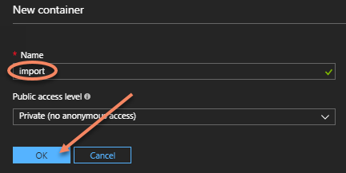
4. Once the container is created, click on the container name (`import`) to open the container, then click `Upload`.

    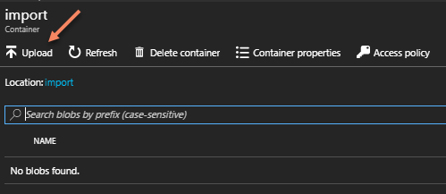
5. Click the folder to browse to the `GoodData.csv` file, choose the file and click `Upload`.

    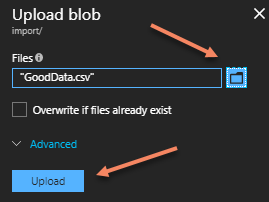
6. Navigate back to the function app and click `Monitor`.

    
7. Wait for the logs to appear (use the refresh button if necessary). After the log appears, click on the log entry to view the log information and verify the data was inserted.

    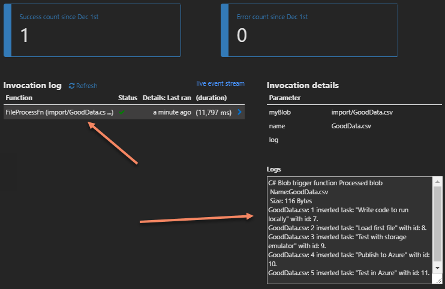
8. Use SQL Server Management Server to verify the records.
9. Repeat steps 4 - 7 with the `BadData.csv` file.

Congratulations! You have successfully completed this lab to create a serverless function that imports files into a SQL database.